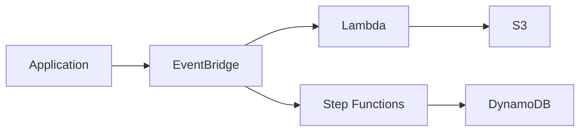

## **Course:** AWS Certified Solutions Architect – Professional (Exam SAP-C02)

**Post-migration goals**

After a migration, your job shifts from “move it” to “improve it.” You validate that the workload is stable, then reduce operational burden, improve resilience, and modernize components where the business gets measurable value. In SAP-C02 scenarios, the best answer is often incremental: optimize first, then modernize the highest-risk or highest-cost parts.

- **Stabilize** the workload before making large design changes.
- **Measure** baseline performance, cost, and reliability before tuning.
- **Modernize** only where the change reduces toil, risk, or spend.

A practical post-migration workflow usually follows this order:

1. Confirm functional parity and operational readiness.
2. Review metrics, logs, traces, and cost data.
3. Identify bottlenecks, waste, and single points of failure.
4. Replace custom or self-managed components with managed services where appropriate.
5. Re-test failure modes and rollback paths.

**Assessment and optimization workflow**

Use migration and optimization tools together. AWS Migration Hub helps you track migration progress and centralize application-level visibility. AWS Application Migration Service can support post-cutover actions, such as automation that runs after the server is launched in AWS, which is useful for validation, configuration drift correction, or cleanup tasks. For rightsizing and modernization recommendations, pair service telemetry with AWS-native advisors.

- **AWS Migration Hub** gives you a central view of application migration status.
- **AWS Application Migration Service** can support post-cutover automation and validation steps.
- **AWS Compute Optimizer** helps identify rightsizing opportunities for supported resources after enough usage history exists.
- **AWS Trusted Advisor** highlights cost, fault tolerance, security, and service limit checks.

A useful assessment loop is:

```bash
aws cloudwatch get-metric-statistics \
  --namespace AWS/EC2 \
  --metric-name CPUUtilization \
  --dimensions Name=InstanceId,Value=i-0123456789abcdef0 \
  --start-time 2026-04-20T00:00:00Z \
  --end-time 2026-04-26T00:00:00Z \
  --period 3600 \
  --statistics Average Maximum
```

Use this kind of query to establish baseline utilization before changing instance size, storage type, or scaling policy. For Auto Scaling groups, prefer group-level metrics in the `AWS/AutoScaling` namespace when you want scaling decisions based on the fleet rather than a single instance.

**Compute, scaling, and load balancing**

Post-migration compute optimization usually starts with rightsizing and then moves to elasticity. Do not assume the original on-premises sizing is still correct in AWS. Many workloads are overprovisioned because they were sized for peak plus safety margin.

- **Rightsize** EC2 instances based on CPU, memory, network, and disk behavior.
- **Use Auto Scaling** for variable demand instead of static headroom.
- **Prefer managed load balancing** to remove custom traffic distribution logic.
- **Consider Graviton** instances when the application stack is compatible and cost/performance improves.

For Auto Scaling, use group-level metrics and policies that reflect the workload pattern:

```json
{
  "AlarmName": "asg-high-average-cpu",
  "Namespace": "AWS/AutoScaling",
  "MetricName": "GroupAverageCPUUtilization",
  "Dimensions": [
    {
      "Name": "AutoScalingGroupName",
      "Value": "app-prod-asg"
    }
  ],
  "Statistic": "Average",
  "Period": 300,
  "EvaluationPeriods": 2,
  "Threshold": 70,
  "ComparisonOperator": "GreaterThanThreshold"
}
```

This is appropriate when you want to scale the group based on fleet utilization. For instance-level alarms, use `AWS/EC2` and `InstanceId`. Mixing an Auto Scaling group dimension with an EC2 metric is not a valid standard configuration.

- **Target tracking** is often simpler than step scaling for common metrics.
- **Scheduled scaling** helps with predictable business cycles.
- **Warm pools** can reduce scale-out latency for stateful startup-heavy applications.
- **ALB** health checks and deregistration delay help avoid dropping in-flight requests during scale events.

**Storage modernization and data tiering**

Storage is often the fastest place to find savings and performance gains. After migration, review each storage layer separately: block, file, object, and archival. The right answer depends on access pattern, latency tolerance, and operational overhead.

- **EBS**: optimize volume type and size for the workload.
- **EFS**: use for shared POSIX file access across multiple instances or containers.
- **FSx**: choose when you need a specialized file system such as Windows file shares or high-performance workloads.
- **S3**: use for durable object storage, static assets, backups, and data lakes.
- **Archive tiers**: use for infrequently accessed data with long retention.

For EBS, choose the volume type based on IOPS, throughput, and cost:

| Use case | Common choice | Why |
|---|---|---|
| General-purpose boot or app volumes | `gp3` | Predictable baseline performance and flexible sizing |
| High IOPS databases | `io2` / `io2 Block Express` | High durability and sustained IOPS |
| Throughput-heavy sequential workloads | `st1` | Lower cost for large sequential reads/writes |
| Cold, infrequent access | `sc1` | Lowest-cost HDD option |

- **Rightsize EBS** by separating storage capacity from performance where possible.
- **Use EBS snapshots** for backup and recovery, not as a substitute for application-aware replication.
- **Use S3 lifecycle policies** to transition objects to cheaper storage classes.
- **Use Intelligent-Tiering** when access patterns are unknown or change over time.

Example S3 lifecycle policy:

```json
{
  "Rules": [
    {
      "ID": "archive-old-logs",
      "Status": "Enabled",
      "Filter": {
        "Prefix": "logs/"
      },
      "Transitions": [
        {
          "Days": 30,
          "StorageClass": "STANDARD_IA"
        },
        {
          "Days": 90,
          "StorageClass": "GLACIER_IR"
        },
        {
          "Days": 180,
          "StorageClass": "DEEP_ARCHIVE"
        }
      ]
    }
  ]
}
```

Use lifecycle transitions when the business can tolerate retrieval delays. For compliance archives, verify retention and restore requirements before moving data to deep archive classes.

**Application modernization beyond lift-and-shift**

A common exam theme is deciding when to stop at optimization and when to refactor. Modernization should reduce operational burden or unlock a capability the current design cannot provide.

- **Serverless refactoring** fits event-driven, bursty, or integration-heavy workloads.
- **API Gateway** is useful when you want managed API front doors, throttling, auth, and request transformation.
- **AWS Lambda** works well for short-lived stateless compute.
- **Step Functions** orchestrates multi-step workflows and compensating actions.
- **EventBridge** routes events to targets; it does not execute work by itself.
- **SQS** decouples producers and consumers when you need buffering and retry control.
- **SNS** is useful for fan-out notifications and simple pub/sub patterns.
- **DynamoDB** is a strong target for key-value and document workloads with predictable access patterns.
- **RDS Proxy** helps with connection pooling for spiky or serverless database clients.
- **ElastiCache** reduces read pressure on databases for hot, cacheable data.

A common modernization path is:

1. Keep the existing application interface.
2. Move asynchronous or background tasks to SQS, EventBridge, or Step Functions.
3. Replace custom schedulers with managed event routing and orchestration.
4. Extract stateless functions into Lambda where latency and runtime limits fit.
5. Replace self-managed data access patterns with managed databases or caches.

Example event-driven pattern:



This pattern is useful when you want to reduce synchronous coupling and make the system easier to scale independently.

**Observability and operational validation**

After migration, observability is how you prove the workload is healthy and where you find the next optimization. Use metrics, logs, and traces together rather than relying on one signal.

- **CloudWatch dashboards** give you a shared operational view for business and technical metrics.
- **CloudWatch Logs Insights** helps you query logs quickly without exporting them first.
- **CloudWatch anomaly detection** can highlight unusual metric behavior without hardcoding every threshold.
- **AWS X-Ray** helps trace requests across services and identify latency hotspots.
- **CloudWatch alarms** should reflect user impact, not just infrastructure saturation.

A practical dashboard usually includes:

- Request rate, error rate, and latency.
- CPU, memory, disk, and network for compute nodes.
- Queue depth and age for asynchronous systems.
- Database connections, read/write latency, and cache hit ratio.
- Cost-sensitive signals such as NAT Gateway bytes processed or cross-AZ traffic where measurable.

Example Logs Insights query:

```sql
fields @timestamp, @message
| filter @message like /ERROR|Exception/
| sort @timestamp desc
| limit 50
```

Use X-Ray sampling when full tracing is too expensive or too noisy. Increase sampling temporarily during incidents or modernization testing, then reduce it after you identify the bottleneck.

**Security and governance modernization**

Post-migration is a good time to simplify identity, tighten permissions, and improve auditability. The goal is least privilege with less operational friction.

- **IAM Identity Center** centralizes workforce access across accounts and applications.
- **Permission boundaries** help control the maximum permissions a role or user can receive.
- **Cross-account access** is often cleaner than sharing long-lived credentials.
- **AWS Organizations** and service control policies help enforce guardrails at scale.
- **AWS KMS** key policies and grants should be reviewed after workload moves to AWS.

Common patterns:

- Use **IAM Identity Center** for human access instead of long-lived IAM users.
- Use role assumption for application-to-application or account-to-account access.
- Use permission boundaries for delegated administration or platform teams.
- Use separate accounts for prod, nonprod, shared services, and security tooling.

Example cross-account role assumption:

```bash
aws sts assume-role \
  --role-arn arn:aws:iam::123456789012:role/ReadOnlyAuditRole \
  --role-session-name audit-session
```

Security modernization also includes secret handling and network controls:

- Store secrets in **AWS Secrets Manager** or **SSM Parameter Store** rather than in code.
- Use **VPC endpoints** to reduce public internet exposure for AWS service access.
- Review security groups and NACLs after migration to remove temporary allowances.
- Revisit logging and retention so audit trails meet compliance needs.

**Resilience and disaster recovery choices**

Modernization should improve recovery, not just uptime. The right design depends on recovery time objective (RTO) and recovery point objective (RPO), plus service-specific capabilities.

- **Multi-AZ** is the default resilience choice for many production workloads.
- **Multi-region** is for regional isolation, regulatory needs, or very low tolerance for regional outage.
- **RDS Multi-AZ** improves availability and failover for relational databases.
- **Aurora** supports fast failover and cross-region options such as global databases.
- **ALB** can span multiple Availability Zones, but it is not a multi-region service.
- **DynamoDB** offers multi-AZ durability by default and can use global tables for multi-region replication.

Decision guidance:

| Service | Typical resilience choice | When to use |
|---|---|---|
| RDS | Multi-AZ | Production databases needing automatic failover |
| Aurora | Multi-AZ, optionally global database | Low failover time or multi-region read/locality needs |
| ALB | Multi-AZ | Regional application traffic distribution |
| DynamoDB | Multi-AZ by default, global tables for multi-region | Highly available key-value/document workloads |
| S3 | Regional durability with optional replication | Object storage with DR or locality requirements |

Disaster recovery patterns still matter, but choose them based on business recovery needs rather than labels alone:

- **Backup and restore**: lowest cost, highest recovery time.
- **Pilot light**: keep critical components running in minimal form; actual RPO depends on replication and data sync design.
- **Warm standby**: smaller active environment ready to scale up quickly.
- **Multi-site active/active**: highest complexity and cost, best for stringent availability needs.

> Do not treat DR pattern names as fixed cost or RPO categories. The actual recovery characteristics depend on replication frequency, automation, and how much of the stack is pre-provisioned.

**Cost optimization and network efficiency**

A lot of post-migration spend comes from traffic patterns, not just compute. Review where data moves and why.

- **Cross-AZ traffic** can become expensive for chatty architectures.
- **NAT Gateway** charges can dominate if private subnets send large volumes to the internet.
- **Inter-region transfer** should be minimized unless business requirements justify it.
- **Data transfer out** to the internet is often a major hidden cost.
- **Caching** and **locality** reduce repeated reads and remote calls.

Ways to reduce network cost:

- Keep tightly coupled components in the same Availability Zone when resilience requirements allow it.
- Use VPC endpoints for S3, DynamoDB, and other supported services to avoid NAT traversal.
- Replace frequent synchronous cross-service calls with asynchronous messaging where appropriate.
- Use CloudFront for internet-facing static and cacheable content.
- Compress payloads and reduce chatty APIs.

Example VPC endpoint policy pattern:

```json
{
  "Statement": [
    {
      "Effect": "Allow",
      "Principal": "*",
      "Action": "s3:*",
      "Resource": [
        "arn:aws:s3:::my-bucket",
        "arn:aws:s3:::my-bucket/*"
      ]
    }
  ]
}
```

Use this carefully with least privilege and bucket policies. The goal is to keep traffic on the AWS backbone where possible and reduce NAT Gateway dependence.

**Phased modernization strategy**

The safest modernization path is incremental. Big-bang refactors are risky after a migration because you lose the ability to isolate whether a problem came from the move or the redesign.

- **Phase 1: stabilize**
  - Fix functional issues.
  - Confirm backups, monitoring, and access controls.
  - Establish baseline metrics and costs.

- **Phase 2: optimize**
  - Rightsize compute and storage.
  - Tune scaling policies.
  - Reduce network and data transfer waste.

- **Phase 3: modernize**
  - Replace custom components with managed services.
  - Introduce event-driven patterns.
  - Refactor high-value modules to serverless or managed databases.

- **Phase 4: harden**
  - Re-test failover and restore.
  - Validate security guardrails.
  - Document runbooks and operational ownership.

This phased approach is especially useful when the application is business-critical or has limited test coverage.

**Exam-style decision cues**

When you see a scenario, look for the constraint that matters most.

- If the workload is stable but expensive, start with **rightsizing** and storage tuning.
- If the workload has bursty traffic and custom schedulers, consider **Lambda**, **Step Functions**, or **EventBridge**.
- If the database has connection storms, consider **RDS Proxy**.
- If reads dominate and data is cacheable, consider **ElastiCache**.
- If the app needs shared file access, compare **EFS** and **FSx** rather than forcing EBS.
- If the issue is recovery time, compare **Multi-AZ** and **multi-region** before choosing a DR pattern.
- If the issue is network cost, inspect **NAT Gateway**, cross-AZ traffic, and data transfer paths.

A simple decision tree:

1. Is the workload already stable?
   - If no, fix reliability first.
   - If yes, continue.
2. Is the main problem cost, performance, or resilience?
   - Cost: rightsize, storage tiering, network reduction.
   - Performance: caching, scaling, database tuning, queue decoupling.
   - Resilience: Multi-AZ, replication, backup automation, failover testing.
3. Can a managed service replace custom code or infrastructure?
   - If yes, modernize incrementally.
   - If no, optimize the current design.

**Practical examples**

A legacy web app migrated to EC2 may benefit from:

- `gp3` EBS volumes instead of oversized `io1` volumes.
- An ALB with target tracking Auto Scaling.
- CloudWatch dashboards for latency and error rate.
- RDS with Multi-AZ and RDS Proxy for database connection pooling.
- S3 for static assets with CloudFront in front.

A batch processing system may benefit from:

- SQS buffering to absorb spikes.
- Step Functions for orchestration and retries.
- Lambda for short tasks, or ECS/Fargate for longer containerized jobs.
- EventBridge for scheduled or event-driven triggers.
- S3 lifecycle transitions for output retention.

A document-processing platform may benefit from:

- S3 event notifications to trigger processing.
- Lambda for lightweight parsing.
- DynamoDB for metadata and workflow state.
- Step Functions for multi-step approval or enrichment flows.
- X-Ray and Logs Insights for tracing and debugging.

**Key takeaways**

Post-migration optimization is about proving value after the move. Use metrics to find waste, managed services to reduce toil, and phased modernization to lower risk. In SAP-C02 scenarios, the best answer usually balances performance, cost, resilience, and operational simplicity rather than chasing the most advanced architecture.

End of Notes