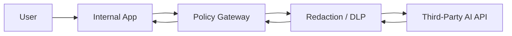

## **Course:** CompTIA SecAI+ Complete Course (Exam SY0-SAI+)

**Overview**

Open-source models, model hubs, and third-party AI services are three common ways to obtain and deploy AI capabilities. They differ in control, cost, operational burden, and security exposure. In security-focused environments, you evaluate not only model quality but also provenance, licensing, data handling, update cadence, and the trust boundary created by each delivery model.

A useful mental model is:

- **Open-source models** give you the most control, but you own deployment, hardening, and lifecycle management.
- **Model hubs** simplify discovery and distribution, but they introduce supply-chain and trust concerns.
- **Third-party AI services** reduce operational overhead, but they expand privacy, compliance, and vendor-risk considerations.

**Open-Source Models**

Open-source models are machine learning models whose weights, architecture, or code are publicly available under a license that permits use, modification, and redistribution under defined terms. In practice, “open source” can mean different things depending on whether the repository includes only code, only weights, or both. You should verify the actual license and usage restrictions rather than assuming full freedom.

Open-source models are attractive when you need:

- **Local control** over inference and data flow.
- **Customization** through fine-tuning, adapters, or prompt templates.
- **Offline or air-gapped** operation.
- **Cost predictability** when usage volume is high.

Common security and operational benefits include:

- You can inspect model artifacts, training notes, and release history when available.
- You can host the model in your own environment to reduce data exposure.
- You can apply internal scanning, approval, and change-control processes before deployment.

Common risks include:

- **Supply-chain risk** from tampered weights, malicious code, or compromised dependencies.
- **License risk** if the model’s terms restrict commercial use, redistribution, or derivative works.
- **Model risk** from bias, hallucinations, or unsafe outputs that require guardrails.

A practical deployment pattern is to run the model behind an internal API and place policy controls in front of it:

```bash
docker run --gpus all -p 8000:8000 \
  -v /models/llm:/models \
  vllm/vllm-openai:latest \
  --model /models/llm
```

You can then place authentication, logging, and rate limiting at the gateway layer:

```nginx
location /v1/ {
    proxy_pass http://127.0.0.1:8000;
    limit_req zone=ai_api burst=20 nodelay;
    proxy_set_header Authorization $http_authorization;
}
```

When you use open-source models, validate:

- The **license** and any attribution requirements.
- The **source of the weights** and whether checksums or signatures are published.
- The **runtime dependencies** and container image provenance.
- The **data retention** behavior of any surrounding tooling.

**Model Hubs**

Model hubs are centralized repositories or marketplaces for discovering, downloading, and sometimes deploying models. They often provide metadata such as model cards, benchmarks, tags, licenses, and community feedback. A model hub can accelerate adoption because it reduces the friction of finding and testing models.

Typical hub capabilities include:

- Search and filtering by task, size, license, or language.
- Versioned model artifacts and release notes.
- Community ratings, usage examples, and evaluation metrics.
- Integration with SDKs, notebooks, and deployment tools.

Model hubs are useful when you want to:

- Compare multiple models quickly.
- Reuse community-tested artifacts.
- Standardize model acquisition across teams.
- Track versions and metadata in one place.

Security concerns are especially important because hubs can become a distribution point for untrusted artifacts. Treat hub content as untrusted until verified.

Key risks include:

- **Typosquatting** or impersonation of popular model names.
- **Malicious artifacts** embedded in model files, scripts, or companion code.
- **Metadata deception** where benchmark claims or license labels are inaccurate.
- **Dependency confusion** if hub packages are pulled into automated pipelines without pinning.

A secure acquisition workflow should include:

1. Verify the publisher identity and repository ownership.
2. Review the model card, license, and intended use.
3. Pin the exact version or commit hash.
4. Validate checksums or signatures if provided.
5. Scan associated code and containers before deployment.
6. Test in a sandbox before production use.

Example of pinning a model revision in a Python workflow:

```python
from transformers import AutoTokenizer, AutoModelForCausalLM

model_id = "org/model-name"
revision = "a1b2c3d4e5f6"

tokenizer = AutoTokenizer.from_pretrained(model_id, revision=revision)
model = AutoModelForCausalLM.from_pretrained(model_id, revision=revision)
```

If the hub supports signed artifacts or attestations, prefer them. If not, compensate with internal allowlists, artifact hashing, and controlled mirrors.

**Third-Party AI Services**

Third-party AI services are externally hosted AI capabilities delivered through APIs or managed platforms. Examples include hosted large language models, speech services, image generation APIs, and managed vector search or embedding services. These services are appealing because they reduce infrastructure management and can provide rapid access to advanced capabilities.

You typically use third-party services when you need:

- Fast time to value.
- Elastic scaling without managing GPUs or model servers.
- Access to proprietary models or specialized features.
- Managed updates and service-level commitments.

The main tradeoff is that you move sensitive processing outside your direct control. That changes your risk profile in several ways:

- **Data exposure**: prompts, files, embeddings, and outputs may traverse or be stored by the provider.
- **Compliance**: data residency, retention, and subprocessors may affect regulatory obligations.
- **Vendor lock-in**: prompts, tool schemas, and output formats may be hard to migrate.
- **Availability risk**: outages, rate limits, or API changes can disrupt dependent systems.

A secure integration pattern is to minimize the data you send and to place a policy enforcement layer between your application and the provider:



Practical controls include:

- **Data minimization**: send only the fields required for the task.
- **Redaction**: remove secrets, personal data, and regulated content before transmission.
- **Tenant isolation**: separate environments, keys, and logs by business unit or sensitivity level.
- **Key management**: store API keys in a secrets manager, not in source code.
- **Monitoring**: log request IDs, latency, and error codes without storing sensitive payloads unless approved.

Example of using an environment variable for an API key:

```bash
export AI_API_KEY="$(pass show prod/ai/api-key)"
curl https://api.example-ai.com/v1/chat/completions \
  -H "Authorization: Bearer $AI_API_KEY" \
  -H "Content-Type: application/json" \
  -d '{
    "model": "example-model",
    "messages": [
      {"role": "user", "content": "Summarize this policy in 3 bullets."}
    ]
  }'
```

**Comparing the Three Approaches**

| Aspect | Open-Source Models | Model Hubs | Third-Party AI Services |
|---|---|---|---|
| Control | Highest | Medium | Lowest |
| Operational burden | High | Medium | Low |
| Data exposure | Lowest if self-hosted | Depends on where deployed | Highest external exposure |
| Customization | High | High, if artifacts are modifiable | Limited to provider features |
| Supply-chain risk | High | High | Medium, shifted to provider trust |
| Cost model | Infrastructure and staff | Mixed | Usage-based subscription/API |
| Best fit | Sensitive, specialized, or offline use | Discovery and standardized acquisition | Rapid deployment and managed scale |

The right choice depends on your security requirements, budget, and staffing. For highly sensitive workloads, self-hosted open-source models often provide the strongest control. For experimentation and model discovery, hubs are efficient. For production teams that need speed and managed operations, third-party services are often the fastest path, provided governance is in place.

**Security Evaluation Criteria**

When assessing any model source or service, focus on the following categories:

- **Provenance**: Who built it, who published it, and how was it verified?
- **Integrity**: Are artifacts signed, hashed, or otherwise protected from tampering?
- **License**: Are you allowed to use, modify, redistribute, or commercialize it?
- **Data handling**: What data is collected, retained, or used for training?
- **Access control**: Can you restrict who can download, call, or modify the model?
- **Logging and auditability**: Can you trace usage without exposing sensitive content?
- **Update policy**: How are patches, model revisions, and deprecations handled?
- **Supportability**: Can your team operate it, or do you need a vendor?

A simple internal review checklist might look like this:

```text
[ ] License reviewed
[ ] Publisher verified
[ ] Artifact hash recorded
[ ] Sandbox test completed
[ ] DLP policy applied
[ ] Secrets stored in vault
[ ] Logging reviewed
[ ] Rollback plan documented
```

**Common Deployment Patterns**

Open-source models often appear in one of these patterns:

- **Local workstation inference** for development and testing.
- **On-premises inference server** for controlled enterprise use.
- **Private cloud deployment** for scalable but isolated workloads.
- **Edge deployment** for low-latency or disconnected environments.

Third-party services often appear in these patterns:

- **Direct API integration** from an application backend.
- **Brokered access** through an internal AI gateway.
- **Hybrid design** where sensitive preprocessing happens locally and only sanitized data is sent externally.

A hybrid pattern is often the best compromise. For example, you can run local redaction and classification, then send only approved text to a hosted model:

```python
def sanitize(text):
    text = text.replace("SSN:", "REDACTED:")
    return text

payload = {
    "model": "hosted-model",
    "input": sanitize(user_text)
}
```

**Operational and Governance Considerations**

AI systems are not just models; they are services with dependencies, policies, and failure modes. You should manage them like any other critical software supply chain component.

Important governance practices include:

- Maintain an approved model inventory.
- Track model versions, owners, and business purpose.
- Define acceptable use and prohibited data categories.
- Review retention, deletion, and training opt-out terms.
- Reassess risk when a model or provider changes terms.

For regulated environments, pay special attention to:

- **PII** (personally identifiable information) handling.
- **PHI** (protected health information) restrictions.
- Cross-border transfer requirements.
- Incident response procedures for prompt leakage or unauthorized access.

**Practical Selection Guidance**

Choose the option that matches your constraints:

- Use **open-source models** when you need maximum control, offline operation, or deep customization.
- Use **model hubs** when you need discovery, versioning, and standardized acquisition workflows.
- Use **third-party AI services** when speed, managed scaling, and reduced infrastructure burden matter most.

A secure organization often uses all three:

- Hubs for discovery and internal evaluation.
- Open-source models for sensitive or specialized workloads.
- Third-party services for low-risk, high-volume, or time-sensitive tasks.

**Key Takeaways**

- Open-source does not automatically mean safe; you still need provenance, integrity, and license checks.
- Model hubs improve access but can amplify supply-chain risk if you do not verify artifacts.
- Third-party AI services reduce operational work but increase external trust and data-governance requirements.
- The best security posture comes from minimizing data exposure, pinning versions, and enforcing policy at the integration boundary.

End of Notes