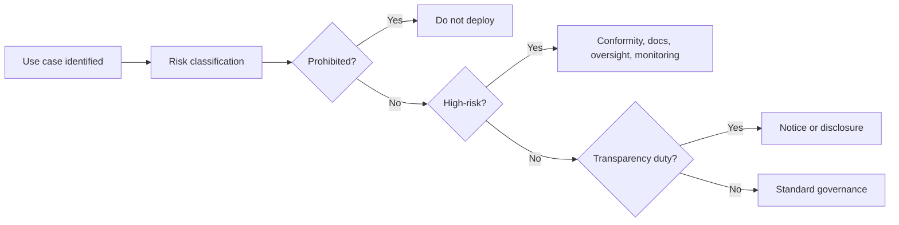

## **Course:** CompTIA SecAI+ Complete Course (Exam SY0-SAI+)

**EU AI Act at a glance**

The EU AI Act is the European Union’s horizontal AI law. It uses a **risk-based framework**: the stricter the potential harm, the heavier the obligations. For exam purposes, focus on three things:

- **Who is in scope**: providers, deployers, importers, distributors, product manufacturers, and some authorized representatives.
- **What the system does**: the intended purpose drives classification more than marketing language.
- **How risky it is**: prohibited, high-risk, transparency-limited, or minimal risk.

The Act is not just a privacy law or a cybersecurity law. It is a product-and-use governance regime for AI systems placed on the EU market, put into service in the EU, or used in ways that trigger the Act’s territorial rules.

**Core legal concepts**

A few terms matter repeatedly:

- **Provider**: the entity that develops an AI system or model, or has it developed, and places it on the market or puts it into service under its own name or trademark.
- **Deployer**: the entity that uses an AI system under its authority, except for personal non-professional activity.
- **AI system**: a machine-based system designed to operate with varying levels of autonomy and that may infer from input how to generate outputs such as predictions, content, recommendations, or decisions.
- **General-purpose AI model (GPAI model)**: a model trained with broad capability that can be adapted to many downstream tasks. “Foundation model” is a common industry term, but the Act uses **general-purpose AI model**.

A practical exam shortcut is to ask: “Is this about the model, the system, or the downstream use?” Many classification errors happen when those are mixed together.

**Scope and territorial reach**

The Act can apply even when the organization is not established in the EU, but the trigger is specific. In general, it covers AI systems or models that are:

- placed on the EU market,
- put into service in the EU,
- used in the EU by a deployer,
- or whose output is used in the EU in certain regulated contexts.

That last point is not a blanket rule that any output used in the EU automatically creates scope. The legal trigger depends on the role of the actor and the type of activity. For exam questions, avoid overgeneralizing territorial reach.

A simple mental model:

```text
Develop in EU? -> likely in scope
Sell/offer in EU? -> in scope
Use in EU? -> in scope for deployer obligations
Outside EU but target EU market/users? -> may still be in scope
```

**Risk classification model**

The Act organizes obligations by risk tier. The classification is not based on “AI is scary” but on the specific use case and intended purpose.

```text
AI use case
   |
   +--> Prohibited practice? ---- yes --> banned
   |
   +--> High-risk category? ----- yes --> strict controls
   |
   +--> Transparency duty? ------ yes --> disclosure/notice
   |
   +--> Minimal risk -----------> general good practice
```

This flow is useful for exam scenarios because the same technology can fall into different tiers depending on how it is used.

**Prohibited AI practices**

The Act bans a narrow set of practices because they are considered unacceptable risk. Do not treat this as a broad ban on all biometric or predictive systems.

Common prohibited categories include:

- **Manipulative or deceptive techniques** that materially distort behavior and are likely to cause significant harm.
- **Exploitation of vulnerabilities** due to age, disability, or social/economic situation in a way that causes or is likely to cause significant harm.
- **Social scoring** by public authorities or on their behalf, when it leads to detrimental or unjustified treatment.
- **Certain predictive policing uses** that predict the risk of a person committing a criminal offense solely based on profiling or personality traits.
- **Untargeted scraping** of facial images from the internet or CCTV to build facial recognition databases.
- **Emotion recognition** in workplaces and educational institutions, subject to the Act’s specific exceptions and context.
- **Biometric categorization** using sensitive traits such as race, political opinions, religious beliefs, sexual orientation, or similar sensitive characteristics, subject to the Act’s specific legal boundaries.
- **Real-time remote biometric identification** in publicly accessible spaces for law enforcement, except for narrowly defined and controlled exceptions.

> The exam trap is to assume “biometric” automatically means “prohibited.” In reality, some biometric uses are prohibited, some are high-risk, and some are allowed only under strict conditions.

**High-risk AI systems**

High-risk status is not automatic just because AI is used in a sensitive domain. The Act uses specific legal categories and intended-purpose criteria.

An AI system is generally high-risk if it is:

- a safety component of a regulated product, or
- a standalone system used in one of the Annex III categories.

Examples of Annex III-style categories include:

- biometric identification and categorization in certain contexts,
- management of critical infrastructure,
- education and vocational training,
- employment, worker management, and access to self-employment,
- access to essential private and public services,
- law enforcement,
- migration, asylum, and border control,
- administration of justice and democratic processes in specific uses.

The key exam nuance is that the category depends on the **specific function**. For example:

- An AI tool used in education is not automatically high-risk just because it is in a school.
- An exam proctoring tool may be high-risk if it fits the relevant intended-purpose category and affects access or evaluation.
- A decision-support tool for judges is not automatically high-risk in every form; the exact intended purpose and legal category matter.
- A hiring tool is high-risk when it materially influences recruitment or selection decisions.

Use this rule of thumb:

- **Domain alone is not enough**
- **Intended purpose controls**
- **Annex III category or regulated product rule must fit**

**High-risk obligations**

High-risk systems carry the heaviest operational burden. The provider must build compliance into the lifecycle, not bolt it on later.

Typical obligations include:

- **Risk management** across the system lifecycle.
- **Data governance** to reduce bias, errors, and poor representativeness.
- **Technical documentation** showing how the system works and how it meets requirements.
- **Logging and record-keeping** for traceability.
- **Transparency to deployers** so they understand capabilities and limits.
- **Human oversight** so people can intervene or override where appropriate.
- **Accuracy, robustness, and cybersecurity** controls.
- **Conformity assessment** before placing the system on the market or putting it into service.
- **Post-market monitoring** and incident reporting.

A practical compliance pattern looks like this:

```text
Design -> test -> document -> assess -> deploy -> monitor -> report
```

For exam scenarios, remember that high-risk compliance is about both **technical controls** and **governance evidence**. If a vendor cannot document training, testing, limitations, and oversight, that is a red flag.

**Example high-risk workflow**

A company builds an AI tool for candidate ranking in recruitment.

1. You identify the intended purpose: ranking applicants for employment.
2. You map the use case to the relevant high-risk category.
3. You document training data sources, known limitations, and bias testing.
4. You implement human review before final hiring decisions.
5. You provide instructions to the employer on proper use and limitations.
6. You monitor performance after deployment and log incidents.

This is the kind of scenario where the Act expects controls before and after launch, not just a policy statement.

**Transparency obligations**

Transparency duties are narrower than “label all AI content.” The Act focuses on specific situations where users should know they are interacting with AI or where content provenance matters.

Common transparency scenarios include:

- **Chatbots**: users should be informed they are interacting with an AI system, unless it is obvious from the context.
- **Emotion recognition**: affected persons may need notice, subject to the legal context and exceptions.
- **Biometric categorization**: notice and safeguards may apply depending on the use case.
- **Deepfakes and synthetic or manipulated media**: disclosure is required in defined cases, especially when content could mislead people about authenticity.

Do not overstate this as a blanket requirement for every AI-generated text, image, or audio file. The Act’s transparency rules are more specific and depend on the use case, the audience, and whether the content is materially deceptive or presented as authentic.

A useful exam distinction:

- **Disclosure of AI interaction**: “You are chatting with an AI assistant.”
- **Disclosure of synthetic media**: “This image/video/audio has been artificially generated or manipulated.”
- **General content labeling**: not universally required for all AI outputs.

**General-purpose AI models**

The Act also regulates **general-purpose AI models** because they can be reused across many downstream applications. This is separate from high-risk system rules.

Baseline obligations for GPAI model providers generally include:

- preparing technical documentation,
- providing information to downstream providers so they can integrate the model safely,
- putting in place a policy for copyright compliance,
- publishing a summary of the content used for training in the form required by the regime.

The training-data requirement is often misstated. The Act does not simply require a detailed public dump of training data. It requires a summary of the content used for training, with the exact disclosure format governed by the framework.

For the exam, distinguish:

- **GPAI model obligations**: model-level documentation and transparency.
- **High-risk system obligations**: use-case-level controls and conformity.
- **Deployer obligations**: safe use, oversight, and operational compliance.

**GPAI with systemic risk**

Some GPAI models are considered to pose **systemic risk** because of their capability, reach, or impact. These models face additional duties such as:

- model evaluation and adversarial testing,
- serious incident reporting,
- cybersecurity protections,
- risk mitigation measures,
- enhanced documentation and cooperation with regulators.

A simple way to remember it:

- **GPAI** = broad model governance
- **Systemic-risk GPAI** = stronger governance and monitoring

**Roles and responsibilities**

Different actors have different duties. This is a common exam theme.

- **Provider**
  - designs or places the system/model on the market
  - carries the main compliance burden for development and documentation
- **Deployer**
  - uses the system in real operations
  - must follow instructions, supervise use, and report issues where required
- **Importer/distributor**
  - checks that required documentation and conformity information exist
  - avoids placing noncompliant systems into the market chain
- **Authorized representative**
  - acts on behalf of a non-EU provider for certain compliance tasks

A vendor can be both provider and deployer in different contexts. Always identify the role for the specific activity in the question.

**Borderline classification examples**

These examples help avoid common mistakes.

| Scenario | Likely classification | Why |
|---|---|---|
| Chatbot answering customer questions | Transparency-limited | Users should know they are interacting with AI |
| Resume-ranking engine | High-risk | Employment-related intended purpose |
| AI that flags suspicious transactions | Usually not automatically high-risk | Depends on intended purpose and regulatory context |
| Emotion detection in a classroom | Potentially prohibited or tightly restricted depending on use | Context matters; do not generalize |
| Facial recognition for a private photo app | Not automatically prohibited | Prohibition is narrower than “all facial recognition” |
| Real-time face matching for police in public | Narrowly regulated, with exceptions | Law-enforcement biometric rules are specific |
| AI-generated news summary | Usually not automatically labeled under the Act | Transparency depends on use and deception risk |

**Compliance lifecycle view**

A mature AI governance program should align legal, security, and operational controls.



If you cannot draw a mermaid diagram in the exam, keep the logic in mind: classify first, then apply the correct control set.

**Practical governance controls**

Even when a system is not high-risk, good practice still matters.

- Maintain an AI inventory with owner, purpose, data sources, and risk tier.
- Record model version, deployment date, and change history.
- Test for bias, robustness, and prompt injection or misuse where relevant.
- Define human escalation paths for harmful outputs.
- Restrict access to sensitive tools and logs.
- Monitor drift, abuse, and incident trends after deployment.

Example inventory entry:

```yaml
system_name: CandidateRanker v2
owner: Talent Acquisition
purpose: Rank applicants for interview shortlist
risk_tier: high-risk
controls:
  - human_review_required: true
  - logging_enabled: true
  - bias_testing: quarterly
  - incident_reporting: 24h internal SLA
```

**Exam traps to avoid**

- Do not say all biometric AI is prohibited.
- Do not say all AI in education or employment is automatically high-risk without checking the intended purpose.
- Do not say all synthetic content must be labeled.
- Do not use “foundation model” as if it were the statute’s formal term.
- Do not treat “outside the EU” as automatically out of scope.
- Do not classify based on marketing claims instead of intended purpose.

**Quick memory aid**

- **Prohibited** = unacceptable practices
- **High-risk** = strict lifecycle controls
- **Transparency** = tell people when AI is involved in specific contexts
- **GPAI** = model-level obligations
- **Systemic risk** = extra scrutiny for powerful models

**Why this matters in security work**

The EU AI Act is not only a legal topic. It affects security architecture, vendor selection, logging, incident response, and governance. Security teams often help answer:

- Can this AI system be deployed in the EU?
- What evidence do we need before launch?
- Who reviews outputs and overrides bad decisions?
- How do we document model behavior and incidents?
- What controls reduce misuse, leakage, and unsafe automation?

In practice, AI compliance and AI security overlap. A system that is legally compliant but operationally unsafe is still a business risk.

End of Notes