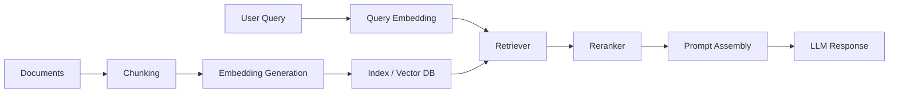

## **Course:** CompTIA SecAI+ Complete Course (Exam SY0-SAI+)

**Overview**

Common application patterns describe how you package a large language model (LLM) into a usable product. The main patterns differ by how much context they retain, whether they can use tools, and how much autonomy they have. For exam prep, focus on the tradeoffs among **latency**, **cost**, **accuracy**, **compliance**, and **operational risk**.

- **Chatbots** answer user prompts with minimal orchestration.
- **Copilots** assist a user inside a workflow and often call tools.
- **RAG** systems retrieve external knowledge before generating an answer.
- **Agentic workflows** plan and execute multi-step tasks with tool use and control logic.

A useful mental model is: chatbots are conversational, copilots are assistive, RAG is knowledge-grounded, and agents are action-oriented.

**Chatbots: Stateless vs Stateful Behavior**

A chatbot is the simplest application pattern: the user sends a message, and the model returns a response. In practice, the system may or may not preserve conversation history. That distinction matters because it changes both user experience and security posture.

- **Stateless chatbot**
  - Treats each turn independently.
  - Sends only the current prompt, or a very small amount of context, to the model.
  - Is cheaper and easier to scale.
  - Reduces privacy exposure because less prior conversation is retained.
  - Works well for FAQs, simple support triage, and one-shot content generation.

- **Stateful chatbot**
  - Preserves conversation history across turns.
  - Supports follow-up questions, clarifications, and continuity.
  - Requires memory management, summarization, or truncation to control token growth.
  - Increases risk if sensitive data is retained too long or shared across sessions.
  - Fits customer support, guided troubleshooting, and long-running interactions.

Stateful behavior is not the same as “the model remembers everything.” In most systems, you manage state explicitly through session storage, summaries, or message windows.

```python
# Simple stateless prompt call
messages = [
    {"role": "system", "content": "You are a concise support assistant."},
    {"role": "user", "content": "Reset my VPN password."}
]
response = client.chat.completions.create(model="gpt-4.1-mini", messages=messages)
```

```python
# Stateful conversation with rolling history
history.append({"role": "user", "content": "My printer is offline."})
history.append({"role": "assistant", "content": "Check the network cable and power."})
history.append({"role": "user", "content": "It is connected. What next?"})
```

- Use **stateless** designs when you want predictable cost and minimal retention.
- Use **stateful** designs when the task depends on prior turns or user-specific context.
- Summarize older turns when the conversation exceeds the model context window.
- Store only the minimum necessary history to satisfy privacy and retention requirements.

> If the conversation includes regulated or sensitive data, treat memory as a data governance problem, not just a UX feature.

**Copilots: Human-in-the-Loop Assistance**

A copilot is an AI assistant embedded in a workflow where the human remains in control. Copilots usually do more than answer questions: they draft, recommend, summarize, classify, or trigger actions that the user approves.

Common copilot characteristics:

- **Human-in-the-loop** approval before high-impact actions.
- **Tool use** such as search, ticketing, email, code editors, or CRM systems.
- **Context awareness** from the current task, document, or application state.
- **Prompt chaining** across multiple turns to refine output.

Prompt chaining is important because many copilot tasks are not solved in one response. You often break the work into stages:

1. Extract relevant facts from the current context.
2. Generate a draft or recommendation.
3. Ask the user to review, edit, or confirm.
4. Apply the approved action or produce the final artifact.

This pattern is common in copilots for legal review, software development, sales enablement, and security operations. The model may first summarize a case, then propose next steps, then ask for confirmation before sending an email or opening a ticket.

```text
Turn 1: "Summarize this incident report."
Turn 2: "Now draft a customer-facing response."
Turn 3: "Before sending, highlight any risky claims."
Turn 4: "Apply the approved response to the ticket."
```

- Use copilots when the user needs speed but still must review the result.
- Use them when mistakes are costly but not fully autonomous action is required.
- Keep the user in control for compliance-sensitive or externally visible outputs.
- Log prompts, tool calls, and approvals for auditability.

**RAG Systems: Grounding the Model in External Knowledge**

Retrieval-Augmented Generation (RAG) combines search and generation. Instead of relying only on the model’s internal parameters, the system retrieves relevant documents from a knowledge source and injects them into the prompt. This improves freshness, traceability, and domain specificity.

A typical RAG pipeline includes:

- **Document ingestion**
  - Pull content from files, wikis, databases, tickets, or web pages.
  - Normalize text, remove boilerplate, and preserve metadata.
- **Chunking**
  - Split documents into smaller passages for retrieval.
  - Keep chunks semantically coherent so the retriever can find useful context.
- **Embedding generation**
  - Convert each chunk into a vector representation using an embedding model.
  - Store vectors in a vector database or search index.
- **Indexing**
  - Save embeddings plus metadata such as source, timestamp, permissions, and document type.
- **Query embedding**
  - Convert the user question into a vector.
- **Retrieval**
  - Find the most similar chunks using vector similarity, keyword search, or hybrid search.
- **Reranking**
  - Reorder retrieved chunks using a stronger model or scoring function.
- **Prompt assembly**
  - Insert the best evidence into the model prompt with instructions to cite or stay within the retrieved context.
- **Generation**
  - Produce the final answer grounded in the retrieved material.



**Chunking Strategy and Tuning**

Chunking is one of the most important RAG design choices. If chunks are too large, retrieval becomes noisy and expensive. If chunks are too small, you lose context and increase the chance of fragmented answers.

- **Small chunks**
  - Improve precision for narrow facts.
  - Increase the chance of missing surrounding context.
  - Can require more retrieved chunks to reconstruct meaning.
- **Large chunks**
  - Preserve context and reduce fragmentation.
  - Increase token cost and may dilute relevance.
  - Can cause the retriever to return broad, less useful passages.

Practical tuning guidance:

- Start with chunk sizes around a few hundred tokens for general knowledge bases.
- Use overlap to preserve continuity across boundaries.
- Tune overlap carefully; too much overlap increases duplicate retrieval.
- Split on semantic boundaries when possible, such as headings, paragraphs, or code blocks.
- Keep tables, policies, and procedures intact when splitting would break meaning.

Example chunking configuration:

```yaml
chunking:
  strategy: recursive
  chunk_size_tokens: 400
  chunk_overlap_tokens: 80
  preserve_headings: true
  split_on:
    - "\n## "
    - "\n### "
    - "\n\n"
```

**Embedding and Index Refresh Pipelines**

RAG quality depends on keeping the index synchronized with source content. A stale index can produce outdated answers even if the model is strong.

A practical ingestion pipeline often includes:

1. Detect new or changed source documents.
2. Extract text and metadata.
3. Chunk the content.
4. Generate embeddings.
5. Upsert chunks into the index.
6. Mark deleted or superseded content as inactive.
7. Rebuild or refresh search statistics if the backend requires it.

Operational patterns:

- Use **incremental ingestion** for frequent small updates.
- Use **batch reindexing** after schema changes or embedding model upgrades.
- Track document version IDs so you can invalidate old chunks.
- Preserve ACLs (access control lists) in metadata so retrieval respects permissions.
- Re-embed content when you change embedding models, chunking rules, or normalization logic.

```bash
# Example ingestion workflow
python ingest.py --source ./policies --index secai-kb --mode incremental
python ingest.py --source ./policies --index secai-kb --mode full-rebuild
```

**Retrieval Tuning: Top-k, Reranking, and Citation Thresholds**

Retrieval tuning directly affects answer quality, latency, and cost.

- **Top-k**
  - The number of candidate chunks retrieved before reranking or generation.
  - Higher values improve recall but increase prompt size and latency.
  - Lower values reduce cost but may miss relevant evidence.
- **Reranking**
  - Improves precision by scoring candidates with a stronger model.
  - Useful when the initial retriever returns many near-matches.
- **Citation thresholds**
  - Define how confident the system must be before it cites or answers.
  - If evidence quality is low, the system should say it cannot verify the answer.

Practical guidance:

- Start with a moderate `top_k` such as 5 to 10 for initial retrieval.
- Use reranking when the corpus is large or terminology is ambiguous.
- Increase `top_k` for broad questions, but watch token budgets.
- Require citations for factual or regulated answers.
- Refuse or hedge when retrieved evidence does not support the claim.

```python
retrieval_config = {
    "top_k": 8,
    "rerank_top_n": 3,
    "min_similarity": 0.72,
    "citation_required": True
}
```

- Use a lower `top_k` for low-latency interactive chat.
- Use a higher `top_k` for research or compliance review.
- Set a citation threshold when users need traceable answers.
- Prefer hybrid retrieval when exact terms and semantic meaning both matter.

> A strong RAG system should answer from evidence, not from memory, when the question depends on current or proprietary information.

**When to Choose RAG**

RAG is the right pattern when the model needs access to information that is too large, too dynamic, or too sensitive to bake into the prompt or fine-tune into the model.

Choose RAG when:

- The knowledge base changes frequently.
- You need source attribution or citations.
- You must keep proprietary data outside the model weights.
- You want to reduce hallucinations on domain-specific facts.
- You need permission-aware retrieval across many documents.

Avoid RAG as the only solution when:

- The task is purely generative and does not need external facts.
- The corpus is tiny and can fit in the prompt.
- The answer must be deterministic and rule-based.
- The latency budget is extremely tight and retrieval overhead is unacceptable.

**Agentic Workflows: Planning, Tools, and Control**

An agentic workflow gives the model a goal and lets it decide which steps to take, often by calling tools repeatedly until it reaches a stop condition. Agents are more autonomous than copilots, so they can solve multi-step tasks, but they also introduce more risk.

Typical agent components:

- **Planner** that decomposes the goal into steps.
- **Tool executor** that calls APIs, scripts, search, or databases.
- **Memory** that stores intermediate results or prior actions.
- **Evaluator** that checks whether the output meets the goal.
- **Controller** that decides whether to continue, retry, or stop.

A common loop is:

1. Interpret the goal.
2. Plan the next action.
3. Call a tool.
4. Observe the result.
5. Decide whether to continue.

```text
Goal -> Plan -> Act -> Observe -> Reflect -> Stop?
```

**Failure Handling in Agentic Workflows**

Agentic systems need explicit failure handling because tool calls can fail, return partial data, or produce unsafe actions. Good designs assume failure is normal.

Common patterns:

- **Retries**
  - Retry transient failures such as network timeouts or rate limits.
  - Use exponential backoff to avoid hammering dependencies.
  - Limit retry count to prevent loops.
- **Fallback paths**
  - Switch to a simpler tool, cached data, or a human review queue.
  - Use fallback when the preferred service is unavailable.
- **Timeout handling**
  - Set per-tool and per-task timeouts.
  - Abort or degrade gracefully when a step takes too long.
- **Stop conditions**
  - Stop when the goal is achieved, confidence is low, budget is exhausted, or the same failure repeats.
  - Prevent infinite loops and runaway cost.
- **Guardrails**
  - Block disallowed actions.
  - Require approval for high-impact operations.
  - Validate tool inputs and outputs before execution.

```python
max_steps = 6
max_retries = 2
for step in range(max_steps):
    try:
        result = call_tool(action, timeout=10)
    except TimeoutError:
        if retries < max_retries:
            retries += 1
            continue
        return "Escalate to human: tool timeout"
    if goal_met(result):
        break
else:
    return "Stop: step budget exhausted"
```

- Use retries for transient infrastructure issues.
- Use fallback paths when business continuity matters.
- Use stop conditions to control cost and prevent loops.
- Escalate to a human when the action is high impact or ambiguous.

**Prompt Chaining and Multi-Turn Orchestration**

Prompt chaining is a core orchestration pattern for copilots and agents. Instead of asking the model to do everything at once, you split the task into smaller prompts with explicit intermediate outputs. This improves reliability, makes validation easier, and supports human review.

Common chaining patterns:

- **Decompose-then-solve**
  - First ask the model to break the task into subproblems.
  - Then solve each subproblem separately.
- **Draft-then-critique**
  - Generate an initial answer.
  - Run a second pass to find errors, omissions, or policy issues.
- **Extract-then-transform**
  - Pull structured facts from unstructured text.
  - Convert them into a report, ticket, or action plan.
- **Plan-then-execute**
  - Create a step plan.
  - Execute each step with tool calls and checks.
- **Summarize-then-query**
  - Condense long context.
  - Use the summary to answer follow-up questions within token limits.

This pattern is especially useful when the output must be validated at each stage. For example, a security copilot may first extract indicators of compromise, then map them to MITRE ATT&CK techniques, then draft a response recommendation, then ask the analyst to approve containment actions.

```text
Prompt 1: Extract facts
Prompt 2: Normalize into schema
Prompt 3: Generate recommendation
Prompt 4: Critique for policy and safety
Prompt 5: Present to user for approval
```

**Business Tradeoffs and Pattern Selection**

Choose the pattern based on risk, latency, cost, and compliance.

| Pattern | Best for | Latency | Cost | Risk | Compliance fit |
|---|---|---:|---:|---:|---|
| Stateless chatbot | FAQs, simple Q&A | Low | Low | Low | Good for low-sensitivity use |
| Stateful chatbot | Ongoing conversations | Medium | Medium | Medium | Needs retention controls |
| Copilot | Assisted work with approval | Medium | Medium | Medium | Strong when auditability matters |
| RAG | Current or proprietary knowledge | Medium | Medium-High | Lower hallucination risk | Strong for traceable answers |
| Agentic workflow | Multi-step task execution | High | High | Highest | Needs strict guardrails |

Practical selection rules:

- Choose **chatbots** when the task is simple and the answer does not depend on external systems.
- Choose **copilots** when a human should approve the final action.
- Choose **RAG** when correctness depends on current documents or internal knowledge.
- Choose **agents** when the system must plan and execute multiple steps across tools.

**Security, Privacy, and Governance Considerations**

These patterns create different security risks.

- **Chatbots**
  - Risk of prompt injection and data leakage if user input is not filtered.
  - Need session isolation and content moderation.
- **Copilots**
  - Risk of over-trusting suggestions.
  - Need approval gates for sensitive actions.
- **RAG**
  - Risk of retrieving unauthorized content if ACLs are not enforced.
  - Risk of prompt injection from malicious documents.
- **Agents**
  - Risk of tool abuse, runaway actions, and unintended side effects.
  - Need allowlists, scoped credentials, and action logging.

Best practices:

- Enforce least privilege for tool credentials.
- Validate retrieved content before inserting it into prompts.
- Separate user input from system instructions.
- Log tool calls, decisions, and approvals.
- Redact secrets and personal data before storage or retrieval.
- Use sandbox environments for testing autonomous workflows.

**Practical Examples**

A support chatbot may answer common questions from a static FAQ and escalate to a human when confidence is low. A sales copilot may draft customer emails from CRM data and require approval before sending. A policy RAG system may retrieve the latest HR handbook and cite the exact section used in the answer. An agentic workflow may triage a security alert, enrich it with threat intel, open a ticket, and notify the on-call analyst if the confidence threshold is met.

```bash
# Example: hybrid search with a vector index and keyword fallback
curl -X POST https://search.example.local/query \
  -H "Content-Type: application/json" \
  -d '{
    "query": "remote access policy for contractors",
    "top_k": 8,
    "hybrid": true,
    "rerank": true
  }'
```

```yaml
agent_policy:
  max_steps: 6
  max_tool_calls: 10
  require_human_approval:
    - send_email
    - delete_record
    - disable_account
  timeout_seconds: 120
  stop_on_low_confidence: true
```

**Exam Focus Summary**

- **Chatbots** are the baseline conversational pattern; distinguish stateless from stateful behavior.
- **Copilots** assist users and often rely on prompt chaining plus human approval.
- **RAG** adds retrieval, chunking, embeddings, indexing, reranking, and citation-aware generation.
- **Agents** add planning, tool use, memory, retries, fallback paths, timeouts, and stop conditions.
- Pattern choice depends on business risk, latency, cost, and compliance requirements.

**Quick Recall**

- Stateless chatbot: minimal memory, low cost, simple use cases.
- Stateful chatbot: conversation continuity, more context management.
- Copilot: human-in-the-loop assistance with tool use.
- RAG: retrieve then generate from external knowledge.
- Agent: plan, act, observe, and stop with guardrails.

End of Notes